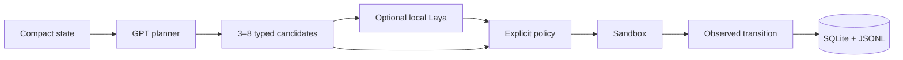

# Laya Dynamics Agent

This research POC evaluates whether a specialised local Laya transition predictor can improve GPT-based agent planning.

[Laya](https://github.com/NandhaKishorM/laya) is a non-autoregressive System 1 decision engine. It answers typed choice, score, and yes/no questions over structured state in a single forward pass.

Here, Laya estimates six properties of each candidate state transition. An explicit policy uses those predictions to select the next action.

For the broader research motivation, see [Toward an Agent with an Abstract Dynamics Model](AGI_WORLD_MODEL_LAYA_SUMMARY.md).



## Install on Debian 13

Use an isolated `uv` environment. Keep the system Python unchanged:

```bash
uv sync --extra test
cp .env.example .env
uv run lda doctor
uv run lda demo
uv run lda benchmark --suite smoke
```

The default demo uses a deterministic fixture planner plus a transparent heuristic predictor, so it works without secrets or model downloads. It validates the loop. Use the real installed local checkpoint for a Laya benchmark:

```bash
uv sync --extra test --extra laya
LAYA_CHECKPOINT=/path/to/checkpoint uv run lda benchmark --suite smoke --with-laya
```

Add `OPENAI_API_KEY` and `OPENAI_MODEL` to `.env` for future live-planner runs. Git ignores `.env`. The CLI fails explicitly when a requested provider is unavailable.
The CLI loads the project-root `.env` automatically. Variables explicitly exported in the shell take precedence.

The sandbox is an in-process deterministic web abstraction with nine tasks across eight templates, primary and secondary sources, contradictions, and a simulated irreversible action. The benchmark has a genuine direct-action control. Candidate-based heuristic and Laya arms replay cached candidate lists for every identical state. Complete transitions go to `data/trajectories.sqlite3` and `logs/runs/<run_id>/events.jsonl`. Reports go to `reports/`. See the [implementation plan](docs/IMPLEMENTATION_PLAN.md), [Laya audit](docs/LAYA_AUDIT.md), and [evaluation protocol](docs/EVALUATION_PROTOCOL.md). Campaign results are recorded in the [experiment log](docs/EXPERIMENT_LOG.md).
See also the [compute strategy](docs/COMPUTE_STRATEGY.md). Phase 1 inference stays local. Nebius is reserved for explicitly authorized fine-tuning and post-training.
For reproducible GPU campaigns, follow the fail-closed [CUDA setup](docs/CUDA_SETUP.md). The staged local-versus-Nebius decision is frozen in the [Laya post-training plan](docs/LAYA_FINETUNING_PLAN.md).
The operational cloud procedure is the [Nebius post-training runbook](docs/NEBIUS_POSTTRAIN_RUNBOOK.md). Resource provisioning remains manual, and paid training requires explicit approval.
Nebius training runs inside a logged `screen` session. Reattaching shows the original human-readable pipeline output while structured JSONL remains available for audit.
Machine-specific commands are kept in [LOCAL_PHASE1_COMMANDS.md](docs/LOCAL_PHASE1_COMMANDS.md), outside the portable quickstart.

Milestone 1 provides the reliable end-to-end loop, direct-GPT and candidate-selector controls, candidate caching, nine deterministic tasks, the real Laya adapter, storage, loop guards, token and latency telemetry, and aggregate reporting. The smoke and challenge suites validate the engineering path. Research conclusions use the held-out templates and sample sizes defined in the evaluation protocol.


## OpenRouter planner

OpenRouter uses its own key and defaults to the exact model id `openai/gpt-5.6-sol`:

```bash
export OPENROUTER_API_KEY=sk-or-v1-...
export OPENROUTER_MODEL=openai/gpt-5.6-sol
uv run lda benchmark --suite smoke --provider openrouter --with-laya
```

By default, benchmark output is a compact per-episode progress log plus a summary table. Latency telemetry separates planner wall time, fresh candidate generation, cache replay, predictor wall and reported time, policy, environment, framework overhead and complete episode wall time. Reports distinguish selector speed with candidates available from observed or reconstructed end-to-end performance. A warm cache replay is never presented alone as a cold-start speedup. Full metrics remain in `reports/latest/metrics.json`. Add `--json` for the complete terminal JSON or `--debug` for full exception tracebacks.

Use `--fresh-candidate-cache` for a clean live campaign. It creates a campaign-scoped cache, preserves previous caches, and still guarantees that the heuristic and Laya arms compare the same candidate lists inside the campaign.

The CLI exposes two development suites: `smoke` keeps the original three-task wiring check, while `challenge` runs all nine tasks across eight templates with contradictory secondary sources, archived values, primary evidence, and a simulated irreversible branch. Held-out statistical evaluation uses the frozen `final-v001` suite.

The frozen `final-v001` suite is separate: 90 held-out instances across three unseen templates, with 30 instances per template. A protocol-compliant campaign uses exactly seeds `0,1,2,3,4`, CUDA Laya, a live provider, and `--fresh-candidate-cache`. Reports include the suite version, a SHA-256 task-manifest fingerprint, bootstrap intervals, per-template metrics, paired arm comparisons, and an explicit compliance verdict.

A clean local CUDA/OpenRouter challenge run is:

```bash
LAYA_DEVICE=cuda \
uv run lda benchmark \
  --suite challenge \
  --provider openrouter \
  --model openai/gpt-5.6-sol \
  --seeds 0 \
  --with-laya \
  --fresh-candidate-cache
```

Provider fallback is disabled. OAuth is deferred to the later Shopifast-based authentication milestone. During a run, the first `Ctrl+C` requests a graceful stop after the current atomic planner, predictor, or environment operation. The partial run is finalized in SQLite and JSONL with status `interrupted`.
