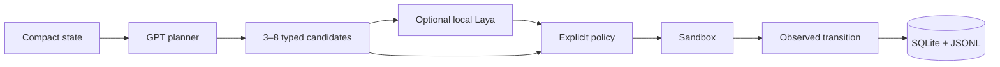

# Laya Dynamics Agent

Research POC asking whether a local, specialised Laya transition predictor can improve a GPT planner over GPT-only. It predicts typed properties of candidate transitions; it is not an AGI framework, a world simulator, or a claim that two models are inherently better than one.



## Install on Debian 13

Use an isolated `uv` environment; never modify system Python:

```bash
uv sync --extra test
cp .env.example .env
uv run lda doctor
uv run lda demo
uv run lda benchmark --suite smoke
```

The default demo uses a deterministic fixture planner plus a transparent heuristic predictor so it works without secrets or model downloads. It validates the loop but is not a Laya benchmark. To exercise the real installed local checkpoint:

```bash
uv sync --extra test --extra laya
LAYA_CHECKPOINT=/path/to/checkpoint uv run lda benchmark --suite smoke --with-laya
```

Add `OPENAI_API_KEY` and `OPENAI_MODEL` to `.env` for future live-planner runs; `.env` is ignored. The current CLI intentionally does not silently substitute a fake Laya or OpenAI result.

The sandbox is an in-process deterministic web abstraction with primary/secondary sources, a contradiction, and a simulated irreversible action. Complete transitions go to `data/trajectories.sqlite3` and `logs/runs/<run_id>/events.jsonl`; reports go to `reports/`. See [implementation plan](docs/IMPLEMENTATION_PLAN.md), [Laya audit](docs/LAYA_AUDIT.md), and [evaluation protocol](docs/EVALUATION_PROTOCOL.md).
See also [compute strategy](docs/COMPUTE_STRATEGY.md) for local, Beyond VRAM, and optional Nebius execution.
Machine-specific commands are kept in [LOCAL_PHASE1_COMMANDS.md](docs/LOCAL_PHASE1_COMMANDS.md), outside the portable quickstart.

Milestone 1 currently provides the reliable end-to-end loop, GPT-only/heuristic controls, the real Laya adapter, storage, loop guards, and smoke reporting. A scientifically meaningful GPT-only versus base-Laya run still requires a configured live GPT planner, local checkpoint, repeated tasks/seeds, and resource charts; fine-tuning is deliberately deferred until this loop is validated.

