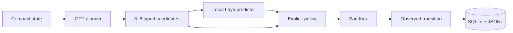
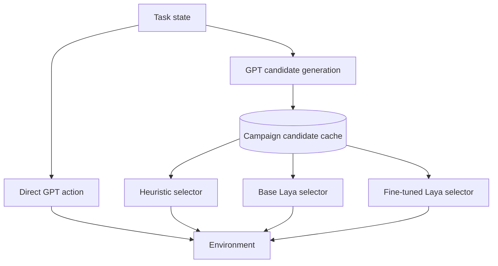

# Laya Dynamics Agent

This research POC evaluates whether a specialised local Laya transition predictor can improve GPT-based agent planning.

[Laya](https://github.com/NandhaKishorM/laya) is a non-autoregressive System 1 decision engine. It answers typed choice, score, and yes/no questions over structured state in a single forward pass.

Here, Laya estimates six properties of each candidate state transition. An explicit policy uses those predictions to select the next action. The central experiment asks whether post-training can preserve Laya's fastest decisions while removing its loops, failures, and long-tail slowdowns.

For the broader research motivation, see [Toward an Agent with an Abstract Dynamics Model](AGI_WORLD_MODEL_LAYA_SUMMARY.md).

## Agent decision loop

GPT proposes typed actions. Laya can score their likely transitions before an explicit policy commits one action to the sandbox.



The direct path from candidates to policy is the transparent heuristic control. The Laya path predicts success, goal progress, information gain, risk, reversibility, and whether more observation is needed.

## Quick start on Debian 13

Use an isolated `uv` environment and keep the system Python unchanged:

```bash
uv sync --extra test
cp .env.example .env
uv run lda doctor
uv run lda demo
uv run lda benchmark --suite smoke
```

The default demo is deterministic and requires neither secrets nor model downloads. To exercise an installed Laya checkpoint:

```bash
uv sync --extra test --extra laya
LAYA_CHECKPOINT=/path/to/checkpoint \
  uv run lda benchmark --suite smoke --with-laya
```

The CLI loads the project-root `.env` automatically. Shell variables take precedence. Git ignores `.env`, and the CLI fails explicitly when a requested provider is unavailable.

For the exact CUDA installation and validation sequence, follow [CUDA setup](docs/CUDA_SETUP.md). The [portable local commands](docs/LOCAL_PHASE1_COMMANDS.md) keep machine-specific paths in shell variables or the ignored `.env` file.

## What the benchmark compares

Every live four-arm campaign compares direct GPT, a transparent heuristic, unmodified Laya, and the fine-tuned Laya checkpoint. Candidate-based arms replay byte-equivalent candidate lists for matching states.



The suites have distinct roles:

- `smoke` checks the three-task execution path.
- `challenge` exercises nine visible development tasks across eight templates.
- `final-v001` contains 90 frozen held-out instances across three unseen templates. Its registered campaign uses seeds `0,1,2,3,4`.

The full experimental contract, gates, arms, paired statistics, and decision rule are defined in the [evaluation protocol](docs/EVALUATION_PROTOCOL.md). Historical campaigns and methodological corrections are preserved in the [experiment log](docs/EXPERIMENT_LOG.md).

## Current experiment status

The `laya-dynamics-v002bis` checkpoint completed training and calibration, passed the corrected offline promotion gate, and passed live four-arm smoke and challenge gates. The registered `final-v001` campaign is paused after 705 of 1,800 episodes because the OpenRouter budget was exhausted. Its checkpoint, candidate cache, logs, reports, databases, environment, and model were evacuated for exact resume. No final result is inferred from the incomplete prefix.

## Run with OpenRouter

OpenRouter uses its own API key. The current reference model is `openai/gpt-5.6-sol`:

```bash
export OPENROUTER_API_KEY=sk-or-v1-...
export OPENROUTER_MODEL=openai/gpt-5.6-sol

uv run lda benchmark \
  --suite smoke \
  --provider openrouter \
  --model "$OPENROUTER_MODEL" \
  --with-laya \
  --fresh-candidate-cache
```

Provider fallback is disabled. OAuth is deferred to the later Shopifast-based authentication milestone.

Long campaigns accept `--campaign-id ID`. Re-run the identical command with `--resume` to skip atomically checkpointed episodes and retain the campaign-scoped cache. The first `Ctrl+C` requests a graceful stop after the current atomic planner, predictor, or environment operation.

## Final four-arm evaluation contract

The registered command shape is shown below for reproducibility:

```bash
LAYA_DEVICE=cuda \
uv run lda benchmark \
  --suite final \
  --provider openrouter \
  --model openai/gpt-5.6-sol \
  --seeds 0,1,2,3,4 \
  --base-laya-checkpoint /path/to/base-english \
  --finetuned-laya-checkpoint /path/to/laya-dynamics-v002bis \
  --fresh-candidate-cache
```

`final-v001` is single-use for the declared base-versus-fine-tuned comparison. Its task manifest, checkpoints, prompt versions, seeds, provider, model, and cache provenance are recorded in the report.

The current campaign has already started. Do not run this command with a new cache. Restore and resume the archived campaign through the [Nebius runbook](docs/NEBIUS_POSTTRAIN_RUNBOOK.md).

## Reading latency correctly

Reports answer two different performance questions:

- **Selector latency** measures Laya and policy time after candidates already exist.
- **End-to-end latency** includes candidate generation, prediction, policy, environment work, and completion of the task.

Telemetry separates planner time, fresh candidate generation, cache lookup, predictor wall time, predictor-reported time, policy, environment, framework overhead, and complete episode wall time. Cache replays are marked as warm observations. When original generation timing is complete, reports also provide a clearly labelled reconstructed end-to-end value.

A warm selector result is never reported as a cold-start system speedup. Exact definitions and paired latency ratios live in the [evaluation protocol](docs/EVALUATION_PROTOCOL.md).

Human-readable progress appears in the terminal. Structured evidence is written to:

- `data/trajectories.sqlite3` for durable transitions.
- `logs/runs/<run_id>/events.jsonl` for run events.
- `reports/latest/metrics.json` for complete metrics.
- `reports/latest/summary.md` for the readable campaign summary.

Add `--json` for complete terminal JSON or `--debug` for full exception tracebacks.

## Post-training

The promoted runtime candidate is `laya-dynamics-v002bis`. GPT-5.6 Sol generated its action sets, each candidate was executed counterfactually on an independent simulator clone, and labels came from observed transitions. Action identifiers are excluded from model input and retained separately for audit.

The training design and promotion criteria are documented in the [Laya post-training plan](docs/LAYA_FINETUNING_PLAN.md). The operational cloud workflow is in the [Nebius runbook](docs/NEBIUS_POSTTRAIN_RUNBOOK.md). Paid resources and training require explicit approval. Training runs inside a logged `screen` session so the original human-readable output remains available alongside structured artifacts.

The interrupted v2 checkpoint is historical evidence and is not eligible for promotion or reuse as v2bis.

## Documentation map

- [Architecture](docs/ARCHITECTURE.md): components, boundaries, and data flow.
- [Evaluation protocol](docs/EVALUATION_PROTOCOL.md): frozen suites, arms, metrics, gates, and decision rule.
- [Experiment log](docs/EXPERIMENT_LOG.md): chronological runs and methodological notes.
- [Laya audit](docs/LAYA_AUDIT.md): upstream API and checkpoint assessment.
- [Implementation plan](docs/IMPLEMENTATION_PLAN.md): milestones and remaining engineering work.
- [Compute strategy](docs/COMPUTE_STRATEGY.md): local inference and cloud training boundaries.
- [Laya post-training plan](docs/LAYA_FINETUNING_PLAN.md): corpus, training, calibration, and promotion.
- [Nebius runbook](docs/NEBIUS_POSTTRAIN_RUNBOOK.md): staging, smoke, full training, recovery, and evacuation.
- [BeyondVRAM audit](docs/BEYONDVRAM_AUDIT.md): reusable cloud-training practices.

The sandbox is a deterministic in-process web abstraction. Results establish performance within this bounded environment. General computer-use claims require separate environments, unseen sites, perturbations, and failure-recovery evaluation.
