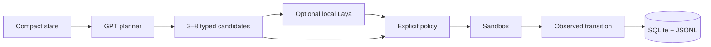

# Laya Dynamics Agent

Research POC asking whether a local, specialised Laya transition predictor can improve a GPT planner over GPT-only. It predicts typed properties of candidate transitions; it is not an AGI framework, a world simulator, or a claim that two models are inherently better than one.



## Install on Debian 13

Use an isolated `uv` environment; never modify system Python:

```bash
uv sync --extra test
cp .env.example .env
uv run lda doctor
uv run lda demo
uv run lda benchmark --suite smoke
```

The default demo uses a deterministic fixture planner plus a transparent heuristic predictor so it works without secrets or model downloads. It validates the loop but is not a Laya benchmark. To exercise the real installed local checkpoint:

```bash
uv sync --extra test --extra laya
LAYA_CHECKPOINT=/path/to/checkpoint uv run lda benchmark --suite smoke --with-laya
```

Add `OPENAI_API_KEY` and `OPENAI_MODEL` to `.env` for future live-planner runs; `.env` is ignored. The current CLI intentionally does not silently substitute a fake Laya or OpenAI result.
The CLI loads the project-root `.env` automatically. Variables explicitly exported in the shell take precedence.

The sandbox is an in-process deterministic web abstraction with three task templates, primary/secondary sources, contradictions, and a simulated irreversible action. The benchmark has a genuine direct-action control; candidate-based heuristic and Laya arms replay cached candidate lists for every identical state. Complete transitions go to `data/trajectories.sqlite3` and `logs/runs/<run_id>/events.jsonl`; reports go to `reports/`. See [implementation plan](docs/IMPLEMENTATION_PLAN.md), [Laya audit](docs/LAYA_AUDIT.md), and [evaluation protocol](docs/EVALUATION_PROTOCOL.md).
See also [compute strategy](docs/COMPUTE_STRATEGY.md): Phase 1 inference stays local; Nebius is reserved for explicitly authorized fine-tuning/post-training.
Machine-specific commands are kept in [LOCAL_PHASE1_COMMANDS.md](docs/LOCAL_PHASE1_COMMANDS.md), outside the portable quickstart.

Milestone 1 currently provides the reliable end-to-end loop, direct-GPT and candidate-selector controls, candidate caching, three deterministic tasks, the real Laya adapter, storage, loop guards, token/latency telemetry, and aggregate reporting. The three-task smoke suite is still an engineering validation, not evidence for the research hypothesis; the full protocol requires held-out templates and the sample sizes defined in the evaluation protocol.


### OpenRouter planner

OpenRouter uses its own key and defaults to the exact model id `openai/gpt-5.6-sol`:

```bash
export OPENROUTER_API_KEY=sk-or-v1-...
export OPENROUTER_MODEL=openai/gpt-5.6-sol
uv run lda benchmark --suite smoke --provider openrouter --with-laya
```

By default, benchmark output is a compact per-episode progress log plus a summary table; full metrics remain in `reports/latest/metrics.json`. Add `--json` for the complete terminal JSON or `--debug` for full exception tracebacks.

No provider fallback is implicit. OAuth is deliberately deferred to the later Shopifast-based authentication milestone. During a run, the first `Ctrl+C` requests a graceful stop after the current atomic planner/predictor/environment operation; the partial run is finalized in SQLite and JSONL with status `interrupted`.
