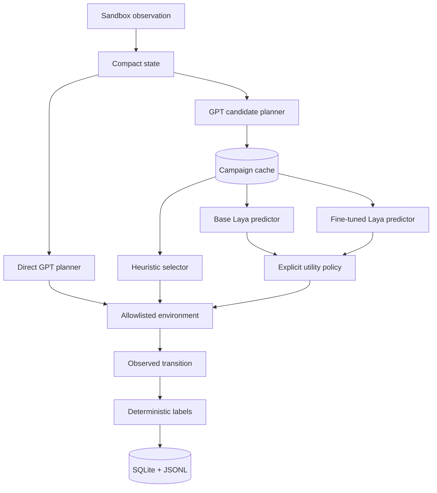

# Architecture

## Runtime decision path

The compact state is supplied to planners and predictors. Raw DOM content is outside the current sandbox. `navigate`, `answer`, and `observe` are the only tools, and environment mutation remains simulated.

Direct GPT chooses one action independently. The three candidate arms share byte-equivalent GPT candidates for identical canonical states. The heuristic scores them directly. Base and fine-tuned Laya predict six transition properties before the same explicit policy chooses an action.

## Measurement boundary

The runner records planner, fresh generation, cache lookup, predictor, policy, environment, framework overhead, and complete episode wall time. Candidate generation and lookup are subdivisions of planner time. Reports keep selector latency separate from observed and reconstructed end-to-end latency.

## Persistence and recovery

Each transition is committed to SQLite and mirrored to JSONL. Long campaigns also write an atomic campaign checkpoint after every completed episode. A resumed campaign uses the same campaign identifier and cache, skips completed run identifiers, and retries only the unfinished episode.

Laya cannot execute tools. It can be removed without changing the planner, environment, storage, or task definitions.
