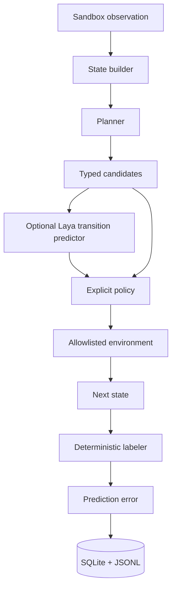

# Architecture

```mermaid
flowchart TD
  O[Sandbox observation] --> S[State builder]
  S --> P[Planner]
  P --> C[Typed candidates]
  C --> L[Optional Laya transition predictor]
  L --> Y[Explicit policy]
  C --> Y
  Y --> E[Allowlisted environment]
  E --> N[Next state]
  N --> B[Deterministic labeler]
  B --> X[Prediction error]
  X --> T[(SQLite + JSONL)]
```

The compact state—not raw DOM—is supplied to both planner and predictor. `navigate`, `answer`, and `observe` are the only Milestone 1 tools. Environment mutation stays simulated.

